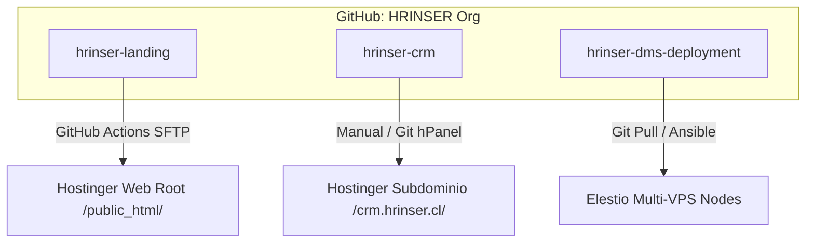

# 📁 Arquitectura y Estrategia de Git & GitHub: Ecosistema HRINSER
**Código del Documento:** HR-DEV-GIT-2026-001  
**Preparado por:** Lead DevOps & Systems Architect  
**Fecha:** 13 de Julio de 2026  

---

## 1. Estructura de Repositorios (Multi-Repository vs. Mono-Repository)

Para el ecosistema digital de **HRINSER**, se recomienda encarecidamente una arquitectura de **Multi-Repository (Repositorios Separados)**. Dado que los componentes se despliegan en infraestructuras diferentes y son mantenidos por diferentes perfiles (Frontend, Backend y DevOps), separar el código previene errores de despliegue cruzados y simplifica la gestión de accesos y permisos.



### 1.1. Detalle de Repositorios Propuestos

#### 1. Repositorio: `hrinser-landing`
* **Propósito:** Alojar el código fuente de la Landing Page corporativa (HTML, CSS, JS, Assets y empaquetador Vite/Tailwind si aplica).
* **Despliegue:** Automatizado mediante GitHub Actions vía SFTP al directorio `/public_html/` de Hostinger.
* **Perfiles con acceso:** Frontend Developers y Diseñadores UI/UX.

#### 2. Repositorio: `hrinser-crm`
* **Propósito:** Alojar las personalizaciones de EspoCRM, el script proxy seguro `submit_lead.php`, el archivo de configuraciones externas `config.php` (solo plantilla `.config.template.php`), y las migraciones de esquemas o Entity Manager backups.
* **Despliegue:** Integración mediante el panel **Git** nativo de Hostinger (hPanel) o despliegue manual controlado a la carpeta `/crm.hrinser.cl/`.
* **Perfiles con acceso:** Backend Developers y Administradores de Sistemas.

#### 3. Repositorio: `hrinser-dms-deployment`
* **Propósito:** Contener las plantillas de orquestación Docker para Nextcloud, configuraciones de hardening de servidores, el `Dockerfile` de Tesseract OCR, plantillas de variables de entorno `.env.template` y el script de copia de seguridad `backup_nextcloud.sh`.
* **Despliegue:** Pull manual o automatizado vía SSH/Ansible directamente sobre cada nodo VPS de Elestio aprovisionado.
* **Perfiles con acceso:** DevOps Engineers, Administradores de Infraestructura y Auditores Técnicos.

---

## 2. Estrategia de Ramas (Branching Strategy)

Se propone utilizar **Trunk-Based Development (Desarrollo Basado en Tronco)** optimizado con ramas de feature cortas, debido al tamaño del equipo y la necesidad de agilidad.

```
       [feature/landing-i18n]  ───┐ (Pull Request & Code Review)
                                  ▼
[main] ────────────────────────────────────────────────────────► (Rama Estable / Producción)
                                  ▲
       [feature/backup-gpg]    ───┘ (Pull Request & Code Review)
```

### 2.1. Reglas de Ramas
* **`main` (Producción):** Es la rama principal e inmutable. Todo lo que esté en `main` debe ser código compilable, estable y listo para producción. Los despliegues automáticos (CI/CD) se gatillan únicamente al hacer push/merge a esta rama.
* **`feature/*` (Características):** Ramas temporales creadas para desarrollar tareas específicas (ej: `feature/rut-validation`, `feature/docker-tz`). Se crean a partir de `main` y se eliminan una vez integradas.

### 2.2. Flujo de Trabajo (Git Workflow)
1. **Crear Feature:** El desarrollador crea una rama local:
   ```bash
   git checkout -b feature/rut-validation
   ```
2. **Desarrollar y Commit:** Seguir la convención de commits semánticos (Conventional Commits):
   * `feat: ...` (nueva característica)
   * `fix: ...` (corrección de bug)
   * `docs: ...` (cambios en documentación)
3. **Pull Request (PR):** Subir la rama a GitHub y abrir un Pull Request hacia `main`.
4. **Code Review & QA:** Otro desarrollador o el auditor técnico revisa el código, verifica el cumplimiento normativo (Ley 21.719) y aprueba el PR.
5. **Merge y Despliegue:** Se realiza el merge a `main` y la herramienta de CI/CD despliega los cambios a Hostinger o Elestio de forma automática.

---

## 3. Seguridad de GitHub y Gestión de Secretos (Secrets)

Para cumplir con el deber de confidencialidad y seguridad del ecosistema:

* **Protección de la Rama `main`:** Configurar reglas de protección de rama en GitHub para:
  * Requerir al menos una aprobación de revisión de código (Pull Request Review) antes del merge.
  * Requerir que las comprobaciones de estado (si existen tests automatizados) pasen exitosamente.
  * Prohibir los force push (`git push -f`) a `main`.
* **Exclusión Estricta de Secretos (`.gitignore`):** Asegurar que las credenciales reales de bases de datos, tokens de reCAPTCHA y llaves GPG privadas **nunca** se suban a GitHub. El repositorio debe contener únicamente archivos de plantilla (ej: `nextcloud.env.template`, `config.template.php`).
* **GitHub Actions Secrets:** Las credenciales de acceso al servidor Hostinger (SFTP) se deben guardar cifradas en **Settings -> Secrets and variables -> Actions** en GitHub, mapeándolas dinámicamente en los flujos de despliegue YAML.

---
*(Fin del Documento)*
