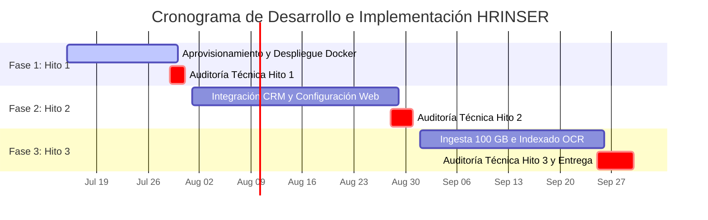

# 🗺️ Hoja de Ruta Oficial y Requerimientos Técnicos: HRINSER
**Proyecto:** Despliegue de DMS Nextcloud, Integración de CRM en la Web y Lanzamiento Comercial.  
**Fecha de Inicio (Kickoff):** 15 de Julio de 2026.  
**Plazo Estimado:** 3 Meses.  

---

## 💻 1. Especificaciones Técnicas Recomendadas para Computadores (PCs)

Para garantizar un rendimiento óptimo de las plataformas web y herramientas administrativas, los computadores de los distintos usuarios del software deben cumplir con los siguientes estándares:

### A. Para Vanessa Galdames (Manager General) y Daniel Tudela (Director)
*Este perfil requiere gestionar múltiples pestañas simultáneamente (CRM, Nextcloud, Hojas de Cálculo y Correo Corporativo).*
* **Procesador (CPU):** Intel Core i5 / AMD Ryzen 5 o superior.
* **Memoria RAM:** 16 GB (Recomendado para evitar lentitud al usar Nextcloud y HubSpot al mismo tiempo) / Mínimo 8 GB.
* **Almacenamiento:** Disco de Estado Sólido (SSD) de 256 GB o superior (crucial para abrir aplicaciones rápidamente).
* **Pantalla:** Resolución Full HD (1920x1080) de al menos 14 pulgadas (facilita la revisión visual de documentos y liquidaciones de sueldo).
* **Sistema Operativo:** Windows 10/11, macOS (12 o superior) o Linux.
* **Navegador Web:** Google Chrome, Brave o Mozilla Firefox (siempre actualizados a su última versión).

### B. Para Clientes Externos (Contratistas que cargan documentos)
*El software Nextcloud es sumamente liviano en el lado del cliente porque todo se procesa en el servidor.*
* **Procesador (CPU):** Cualquiera de gama básica (Intel Core i3 / Celeron moderno o AMD equivalente).
* **Memoria RAM:** 4 GB mínimo (8 GB recomendado).
* **Navegador Web:** Google Chrome, Microsoft Edge, Safari o Firefox.
* **Conexión a Internet:** Conexión de banda ancha estable. Se recomienda una velocidad de subida mínima de **10 Mbps** para evitar retrasos al cargar archivos pesados.

---

## 📅 2. Cronograma y Hitos del Proyecto (3 Meses)

El proyecto comenzará formalmente el **15 de Julio de 2026** (Puntapié inicial). Los 3 meses se estructuran de forma secuencial:

---

## 📋 3. Plan Paso a Paso Detallado (Direcciones Claras)

Sigue esta lista de tareas en orden. No avances al siguiente hito hasta que la auditoría del técnico esté aprobada.

### 🏁 Fase 1: Aprovisionamiento y Plataforma Base (15 Jul – 31 Jul)
* **Objetivo:** Dejar el servidor listo y el DMS Nextcloud funcionando en su versión inicial.
* [ ] **15 de Julio:** Kickoff y compra del servidor VPS en Elestio Cloud.
* [ ] Configuración del dominio y creación de subdominios iniciales (ej. `acceso.hrinser.cl`).
* [ ] Despliegue de Docker, Docker Compose y Nginx Proxy Manager.
* [ ] Instalación de la primera base de datos PostgreSQL y la instancia piloto de Nextcloud.
* [ ] **29 de Julio - Auditoría Técnica 1:** El técnico externo valida la seguridad de los contenedores Docker y que los accesos tengan SSL activo.

### 🌐 Fase 2: Integración Web y CRM (1 Ago – 31 Ago)
* **Objetivo:** Habilitar el canal de adquisición de clientes y la gestión de prospectos.
* [ ] Diseño y programación de la landing page institucional de HRINSER en el servidor.
* [ ] Configuración inicial del HubSpot CRM (etapas del pipeline de clientes).
* [ ] Integración de formularios web: los leads que se registren en la web deben crearse automáticamente en el CRM.
* [ ] Habilitación del sistema de doble factor (2FA) obligatorio para administradores en Nextcloud.
* [ ] **28 de Agosto - Auditoría Técnica 2:** El técnico externo valida la integración de formularios y la seguridad de datos del CRM en la página.

### 📦 Fase 3: Ingesta de Datos, OCR y Capacitación (1 Sep – 30 Sep)
* **Objetivo:** Cargar la base de datos histórica, preparar a Vanessa y lanzar la plataforma.
* [ ] Programación del script SSH para subir los 100 GB de archivos históricos.
* [ ] Execution de la ingesta masiva de datos en Nextcloud.
* [ ] Configuración y automatización del procesamiento OCR nocturno en el servidor.
* [ ] Habilitación de alertas preventivas automáticas de vencimiento de pases/exámenes.
* [ ] Capacitación práctica para Vanessa en la creación y administración de cuentas de contratistas.
* [ ] **25 de Septiembre - Auditoría Técnica 3:** El técnico valida el volumen de datos cargado, que no haya fugas y firma la entrega conforme.
* [ ] **30 de Septiembre:** Lanzamiento oficial y captación de los primeros clientes piloto.
