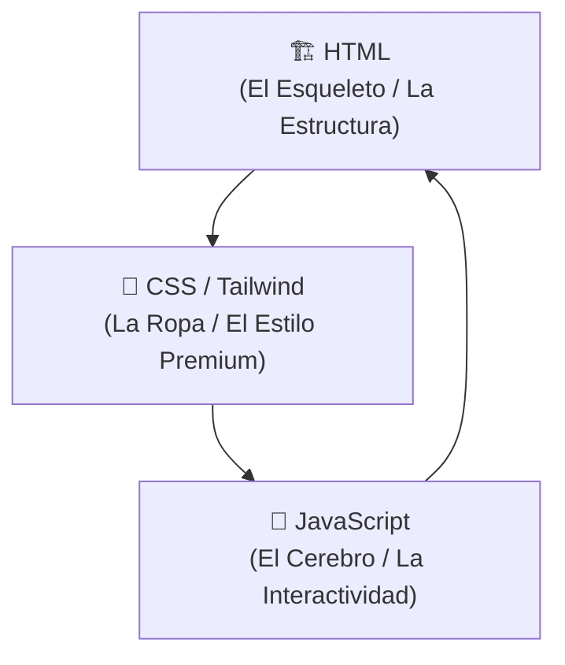

# 💡 Mini-Clase de Frontend: El Arte de Construir Interfaces Premium

¡Hola, Francisca! Como Product Manager o Diseñadora, entender las bases de cómo se construye lo que diseñas te da superpoderes para colaborar con ingeniería y asegurar que la experiencia final sea exactamente como la imaginaste. 

Vamos a ver los tres pilares del Frontend usando como ejemplo el formulario de contacto y el **nuevo checkbox de privacidad** que acabamos de integrar en **HRINSER**.

---

## 🏗️ La Analogía Perfecta: El Esqueleto, la Ropa y el Cerebro

Para dar vida a una interfaz web, combinamos tres tecnologías clave:



### 1. 🏗️ HTML (El Esqueleto)
Es la estructura pura y dura. Define **qué** elementos hay en la pantalla, pero sin ningún estilo. En nuestro formulario, el HTML es el que dice: *"Aquí va una caja de texto para el correo, aquí va un menú de selección de trabajadores, y aquí va nuestro checkbox de privacidad"*.

*   **Ejemplo de nuestro Checkbox en HTML:**
    ```html
    <input type="checkbox" required>
    <span>Acepto la política de privacidad</span>
    ```
    *Sin estilo, esto se vería como un cuadradito gris genérico del navegador de los años 90.*

### 2. 🎨 CSS y Tailwind CSS (La Ropa y el Estilo)
Es la capa visual, la estética y la coherencia de marca. En HRINSER usamos **Tailwind CSS**, un framework que nos permite añadir estilos directamente en el HTML mediante "clases utilitarias". En lugar de escribir archivos CSS gigantes, le ponemos etiquetas descriptivas a nuestro esqueleto.

*   **Cómo vestimos a nuestro Checkbox con Tailwind:**
    ```html
    class="w-4 h-4 rounded border-slate-800 bg-slate-900 text-amber-500 focus:ring-amber-500 focus:ring-2 checked:bg-amber-600"
    ```
    *   `bg-slate-900` y `border-slate-800` lo integran perfectamente en el **modo oscuro**.
    *   `text-amber-500` y `checked:bg-amber-600` hacen que cuando el usuario lo marque, brille con el color ámbar premium de HRINSER en lugar del azul genérico de Windows/Mac.
    *   `focus:ring-amber-500` asegura que si alguien navega con teclado (accesibilidad), el checkbox muestre un indicador visual claro al estar enfocado.

### 3. 🧠 JavaScript (El Cerebro)
Es el comportamiento y la interactividad. Es lo que hace que la página reaccione a las acciones del usuario en tiempo real sin tener que recargar la web.

*   **¿Qué hace JavaScript en nuestro formulario de HRINSER?**
    *   **Traducción en tiempo real:** Cuando el usuario cambia el idioma arriba a "EN" (English), un script de JS recorre la página buscando elementos con la etiqueta `data-translate` y reemplaza el texto al instante (ej: *"Acepto la"* cambia a *"I accept the"*).
    *   **Validación y Lógica:** Si el usuario intenta hacer clic en *"Solicitar Diagnóstico"* sin marcar el checkbox de privacidad, el navegador bloquea el envío y le pide amigablemente que lo acepte.

---

## ⚡ 3 Tips Clave de Frontend para UI/UX & PMs

> [!TIP]
> **1. Piensa en "Estados":** Al diseñar, no diseñes solo la versión estática. Dibuja cómo se ve el checkbox **vació**, **marcado**, **enfocado con teclado (focus)** y **con error** (si no lo marcaron).
> 
> **2. El valor de la Accesibilidad (A11y):** Los tags como `<label for="privacy-consent">` vinculan el texto al checkbox. Esto significa que si haces clic en la palabra "Acepto la...", el checkbox se marcará automáticamente, mejorando la usabilidad en pantallas móviles.
> 
> **3. Mantén los textos independientes del código:** Usar atributos como `data-translate="privacy-link"` permite que mañana puedas cambiar los textos o añadir un tercer idioma (como portugués) sin tener que tocar la estructura visual del formulario.

---
*Este material interactivo fue preparado especialmente para Francisca por el Diseñador UI/UX de HRINSER.*
